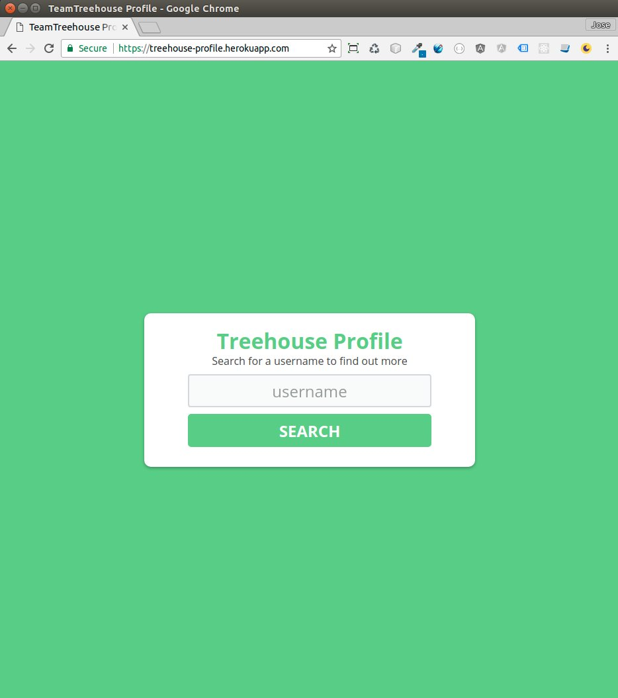
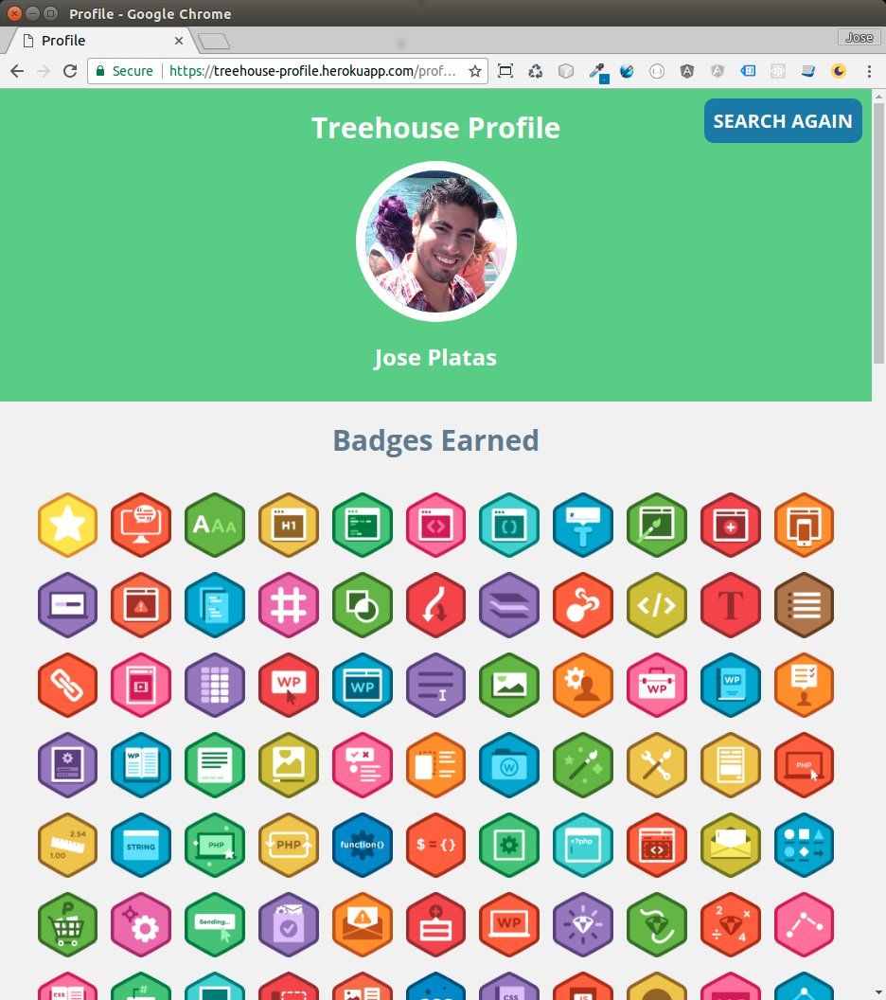

# Custom TeamTreehouse  Profile

**Descritpion:**
This is a node.js application using the handlebars template engine. It uses the TeamTreehouse API to find the information of the user and displays it the best way possible.

This project is running in a heroku dyno:
[https://treehouse-profile.herokuapp.com/](https://treehouse-profile.herokuapp.com/)

**Preview**

